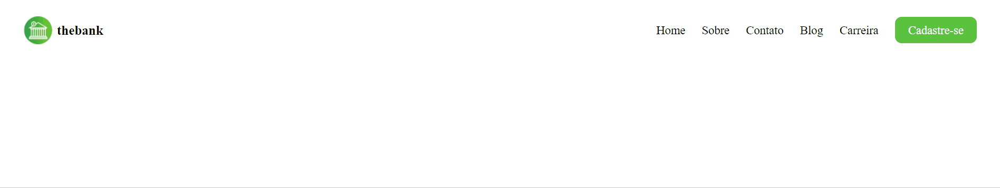

## Exercício 1 - Menu com flexbox 🌟

#### Neste desafio de CSS Avançado o objetivo foi criar um menu responsivo utilizando flexbox. Pude colocar em prática alguns dos muitos conceitos que aprendi durante o módulo, fazendo o uso de flex-direction, justify-content,  align-items, medias queries e afins.

## Tecnologias utilizadas:

 
    
    
    

## Vizualização

[]
  

