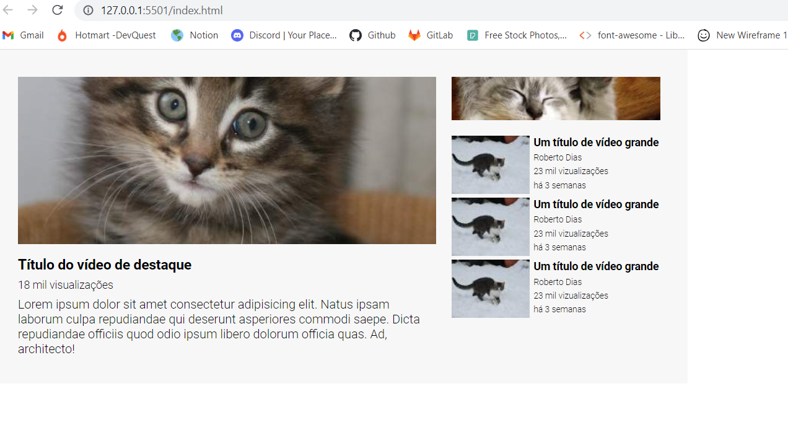

## Exercício 3 - Layout - Youtube com grid e flex 🌟

#### Neste desafio de CSS Avançado o objetivo foi criar um layout baseado no Youtube utilizando grid e flex. Pude colocar em prática o grid-area, grid-template, gap e display grid e flex.

## Tecnologias utilizadas:

 
    
    
    

## Vizualização
#### Para vizualizar no destok basta acessar o link abaixo:

[]